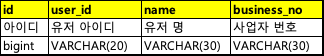
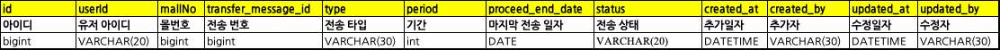

<h2> 구조 </h2>
<h3>기본 가정</h3>
<p>
- 고객이 캐시노트 서버에 결제정보를 저장합니다. <br>
- 고객이 KCD의 관계사에서 활동을 할때 캐시노트에 저장한 정보를 사용하고 싶은 니즈가 있습니다. <br>
- 고객이 약관에 동의를 하면 캐시노트와 관계사들은 고객의 정보를 주고받아 고객이 편리하게 서비스를 이용할 수 있게 합니다. <br>
- 과제의 주제는 캐시노트에 저장한 결제정보를 고객이 다른 관계사 서비스에서 사용하는데 목적이 있다고 가정했습니다. 고객이 약관에 동의하면 캐시노트에 등록한 고객의 결제정보를 협력사에 제공합니다. 
</p>
<h3>CASH 서버</h3>
<p>
CASH NOTE서버라고 가정하고 작업했습니다. 결제내역을 저장하고 있습니다.
</p>
<h3>Friends 서버</h3>
<p>
KCD의 관계사 서버라고 가정하고 작업했습니다. 결제내역을 받아서 저장할 서버입니다.
</p>
<h3>Scheduler 서버</h3>
<p>
CASH NOTE의 결제 정보를 Friends에 전달하는 역할을 합니다. 데이터 전송 작업이 부하가 큰 작업일 수 있다고 생각했습니다. 전송 작업이 CASH NOTE 서비스에 영향을 미치지 않게 전송 작업을 전담하는 서버를 별도로 두었습니다. 
</p>


<h2> 기능 </h2>
<h3>1. 간편연결 등록 </h3>
<p>
host : localhost:8080 (캐시 서버) <br>
url : (POST) /user/agree/simple-connection
</p>
<p>파라미터 </br>
- clientId : (String) 사업자 등록 번호
</p>
<p>
호출예제 </br>

```
curl --location 'http://localhost:8080/user/agree/simple-connection' \
--header 'Content-Type: application/json' \
--data '{
    "clientId" : "123-12-1234"
}'
```
</p>
<p>cash서버를 호출하여 유저약관정보 테이블을 변경합니다. 동의한 시간이 저장이 됩니다. 하나의 컬럼으로 동의 여부와 동의 시간을 확인 할 수 있도록 했습니다.</p>

<h3>2. 정보제공 동의 내역 저장</h3>
<p>
host : localhost:8080 (캐시 서버) <br>
url : (POST) /user/agree/simple-connection
</p>
<p>
호출예제 </br>

```
curl --location 'http://localhost:8080/user/transmission/payments' \
--header 'Content-Type: application/json' \
--data '{
    "clientId" : "123-12-1234"
}'
```
</p>
<p>
cash 서버를 호출하여 정보제공 동의 여부를 저장합니다. friends 서버를 호출하여 cash서버와 friends 서버 두 곳에서 정보제공 동의 여부를 저장하도록 합니다. <br>
cash 서버는 스케쥴러가 결제내역을 저장할 수 있도록 데이터 전송 정보(transfer_message)와 데이터 정보 이력(transfer_message_history)를 저장합니다. <br>
</p>

<h3>3. 거래내역 전송</h3>
<p>
host : localhost:8082 (스케쥴러 서버) <br>
url : (POST) /payments/transfer
</p>
<p>
호출예제 </br>

```
curl --location --request POST 'http://localhost:8082/payments/transfer'
```
</p>
<p>
데이터 전송 이력(transfer_message_history)에 쌓인 데이터를 이용하여 전송 대상을 확인합니다. 데이터 전송 이력(transfer_message_history)의 상태값이 요청(REQUEST)인 요청 이력을 가져옵니다.<br>
데이터 전송 이력의 유저정보와 몰정보를 이용하여 결제정보를 읽어와서 MQ에 전송합니다. friends 서버는 MQ에서 메세지를 받아서 DB에 결제 내역을 저장합니다.<br>
첫 의도는 페이징 처리를 하여 적당한 크기의 데이터 단위로 MQ에 넣으려고 했으나 페이징 처리는 시간상 구현을 못하였습니다.
</p>

<h2> 스키마 </h2>
<h3> 1. 유저 </h3>
<p>user_info</p>



<p>유저는 사업자 단위로 가입한다고 가정했습니다. 유저는 사업자번호로 식별이 가능합니다. DB제약에 유니크인덱스를 걸어서 제약을 거는 것도 바람직 하다고 생각합니다.</p>
<p>유저의 PK는 별도로 채번합니다. 사업자번호가 민감한 정보가 될 수 있고 길어서 사용하기 불편하기 때문에 채번을 하여 유저의 id를 부여합니다. </p>
<p>몰은 유저별로 여러개를 생성할 수 있다고 가정했습니다. 실제 한개 사업자 번호로 여러개의 몰을 운영하는 경우가 있기 때문에 몰과 유저는 1:N관계 입니다.
<p>
주요 컬럼 설명 </br>
- user_id : 유저가 지정한 아이디 </br>
- name : 서비스내에서 유저를 호칭하는 문구 </br>
- business_no : 사업자 번호 </br>
</p>

<h3> 2. 결제 정보 </h3>
<p>payment_detail</p>


<p>캐시노트(Cash)에서 발생하여 공동체(friends)에서 데이터를 가져가는 구조입니다. </p>
<p>결제 정보의 전송은 유저별로 이뤄진다고 가정하였습니다.</p>
<p>
결제 정보의 사용은 몰별로 구분한다고 가정하였습니다. 
신용카드 가맹점번호는 사업자 단위로 가입이 될것으로 예상이 되어 몰별로 판매액을 구분하는 것이 가능한지 불확실 합니다.
다만, 고객이 이용하는 입장에서 몰단위로 구매액을 확인하시고 싶은 니즈가 있을 것 같아 구분이 가능하다고 가정하였습니다.
</p>
<p>
주요 컬럼 설명 </br>
- monthly_installment_plan :할부 정보. 할부 개월 수를 표시. 0이면 일시불. </br>
</p>

<h3> 3. 약관 정보 </h3>


<p> 약관만 관리하는 별도 테이블을 생성했습니다. 
B2B로 서비스 제공하면서 취급이 민감한 정보가 많을 것으로 예상이 됩니다. 
약관과 관련된 정보를 한곳에 모아두는 것이 좋을 것 같다고 판단하여 별도 테이블을 생성했습니다.
모든 약관을 한곳으로 모을지 도메인별로 약관을 따로 관리할지에 대해서는 현업에서의 약관의 종류를 보고 판단 할 수 있을 것 같습니다.
</p>
<p>
주요 컬럼 설명 </br>
- simple_connection_agree_at : 간편연결 등록 일자. 값이 null이면 간편연결을 하지 않았음. </br>
- provide_data_agree_at : 정보제공 동의 등록 일자. 값이 null이면 정보제공에 동의하지 않았음. </br>
</p>

<h3> 4. 전송 정보 </h3>




<p> 
전송과 관련된 테이블을 별도 뺐습니다. 전송의 종류를 저장하는 전송 테이블(transfer_message)와 각각의 1회 전송을 저장하는 전송 정보 이력(transfer_message_history)테이블을 생성하였습니다. <br>
테이블은 결제 내역뿐만아니라 다른 전송 정보들도 범용적으로 사용하기 위해서 type컬럼을 별도로 빼두었습니다.<br>
전송을 미리 예약하는 개념으로 사용여부(use)와 취소일시(cancel_at)을 추가하여 전송을 이전에 등록한 전송을 중단할 수 있도록 하였습니다. 
</p>
<p>
주요 컬럼 설명 <br>
transfer_message <br>
- type : 전송 종류. 결제내역뿐만 아니라 다른 전송이 발생할 때 전송 종류를 구분하는 구분 값. 과제에서는 전일 결제 내역(PAYMENT), 6개월 결제 내역(PAYMENT_INITIAL)을 사용.<br>
- use : 전송 사용여부. <br>
- cancel_at : 전송 중단 일시. 전송을 중단한 시간을 저장하여 향후 발생할 수 있는 문제에 대응.<br>
<br>
transfer_message_history <br>
- transfer_message_id : 전송이력이 어떤 전송의 전송이력인지 구분할 수 하기 위해 저장.
- period : 전송 기간. 일단위로 설정. 마지막 전송일자(proceed_end_date)를 기준으로 이전 몇일 까지 정보를 전송할지 나타내는 정보.
- proceed_end_date : 마지막 전송 일자. 이번 전송에서 전송한 정보 중 가장 마지막 정보의 일자를 기록. 다음 전송때 중복으로 데이터를 보내지 않기 위해 필요.
</p>
